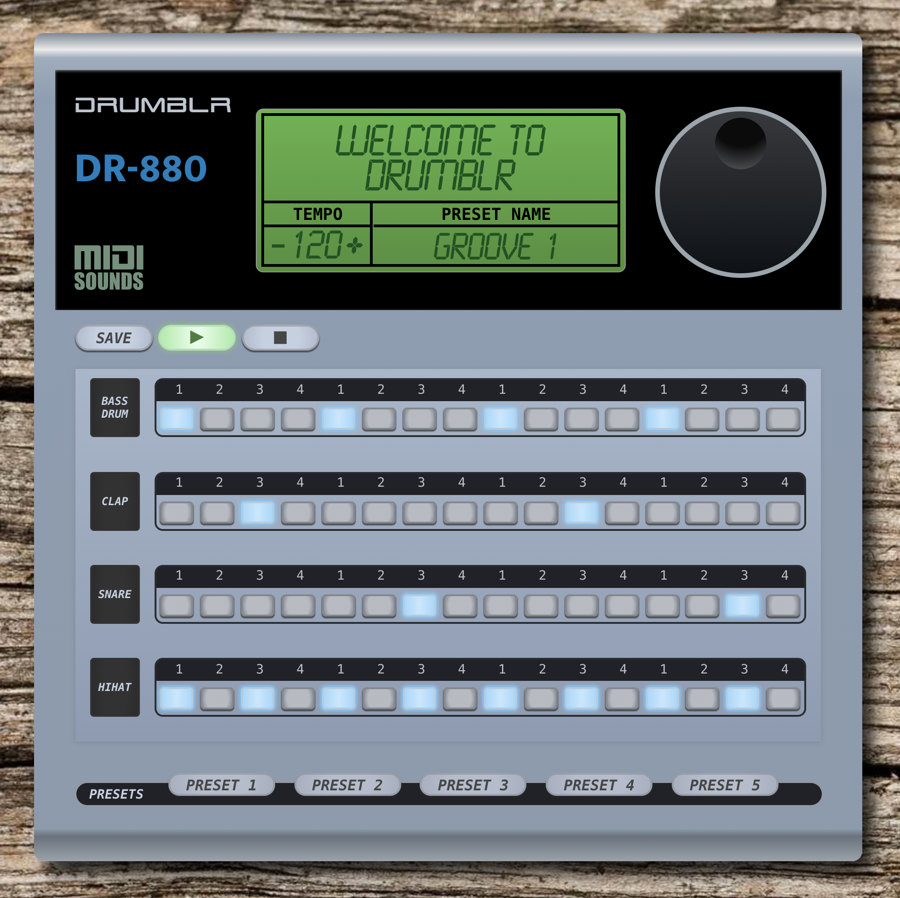

# Drumblr

Designed as an homage to late 80's/early 90's drum machines, **Drumblr** is a digital drum machine users can play in the browser, with customizable tempo, rhythms, and presets.



**Drumblr** uses the midi-sounds-react library (https://www.npmjs.com/package/midi-sounds-react) for samples, allowing users to play and update beats in real time.

**Drumblr** was made with React and JavaScript (frontend) and Ruby on Rails (backend).

Check out the backend code here: https://github.com/ryan-seit/drumblr-backend

To use:

```js
// clone backend first
$ git clone https://github.com/ryan-seit/drumblr-backend.git

// cd into backend folder
$ cd drumblr-backend

// install dependencies and start the server
$ bundle && rails s

// clone frontend repository
$ git clone https://github.com/ryan-seit/drumblr-frontend.git

// cd into the repository
$ cd drumblr_frontend

// install dependencies and run the app
$ npm i && npm s
```

© 2020 - Created by Christopher Leja, Kevin Clark and Ryan Seit
